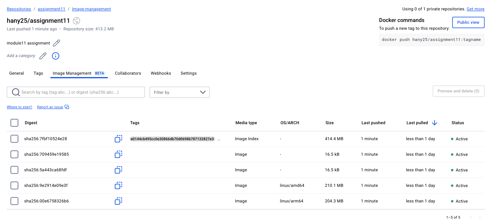

# Assignment 11 — Implement and Test a Calculation Mode

[](https://github.com/Hanyyoussef4/Assignment11/actions/workflows/test.yml)

> **What’s new in Module 11?**
>
> • **Calculation** SQLAlchemy model (`add | sub | mul | div`)
> • Full Alembic migration folder & auto‑generated *add\_calculations\_table* revision
> • Pydantic v2 schemas — `CalculationCreate` & `CalculationRead` (divide‑by‑zero guard)
> • Extra unit / integration tests; CI now runs Alembic, skips Playwright e2e
> • Docker image automatically published to **`hany25/assignment11`** after Trivy scan

Everything from Assignment 10 (JWT auth, users, tests, Dockerised FastAPI) still works.

---

## 🔗 Quick Links

| Resource                | URL                                                                                          |
| ----------------------- | -------------------------------------------------------------------------------------------- |
| **GitHub repo**         | [https://github.com/Hanyyoussef4/Assignment11](https://github.com/Hanyyoussef4/Assignment11) |
| **Docker Hub**          | [https://hub.docker.com/r/hany25/assignment11](https://hub.docker.com/r/hany25/assignment11) |
| **Reflection write‑up** | [`Documentation/Reflection.md`](Documentation/Reflection.md)                                 |

---

## 🐳 Pull & Run the Image

```bash
docker pull hany25/assignment11:latest
docker run -p 8000:8000 hany25/assignment11:latest
```

---

## 📂 Project Layout

```text
.
├── app/
│   ├── models/
│   │   ├── user.py
│   │   └── calculation.py          ← NEW
│   ├── schemas/
│   │   ├── user.py
│   │   └── calculation.py          ← NEW
│   └── operations/                 ← factory for math ops
├── migrations/                     ← NEW (Alembic)
│   ├── env.py
│   └── versions/
├── tests/
│   ├── unit/test_calculation_schema.py
│   ├── integration/
│   └── e2e/                        (Playwright, skipped in CI)
├── Documentation/
│   ├── Docker_Image.png
│   ├── Workflow_Run.png
│   └── Reflection.md
├── Dockerfile
├── docker-compose.yml
└── .github/workflows/test.yml      ← CI/CD workflow (test → security → deploy)
```

---

## 🚦 CI/CD Overview

| Job          | Purpose                                                                                  |
| ------------ | ---------------------------------------------------------------------------------------- |
| **test**     | Spin‑up Postgres service → `alembic upgrade head` → run `pytest -k "not e2e"`            |
| **security** | Build local image, scan with **Trivy** (fail on HIGH / CRITICAL)                         |
| **deploy**   | Push multi‑arch image<br>`hany25/assignment11:{latest, ${{ github.sha }}}` to Docker Hub |

<details>
<summary>Latest successful run</summary>


</details>

---

## 📸 Evidence

| Screenshot                                      | Description                                       |
| ----------------------------------------------- | ------------------------------------------------- |
|         | Images in Docker Hub |
|  | All three jobs green in GitHub Actions            |

---

## ✨ Highlights

* **Model‑level validation** prevents division by zero long before database insert.
* **Alembic** keeps local, test, and production databases in sync through the pipeline.
* **Trivy** gate ensures only vulnerability‑free images reach Docker Hub.
* Modular commit history (“feat: model”, “test: schema”, “ci: pipeline”) speeds code review.

---

## 📝 Reflection

See [`Documentation/Reflection.md`](Documentation/Reflection.md) for a deeper dive into
design decisions, roadblocks, and future improvements.

---
